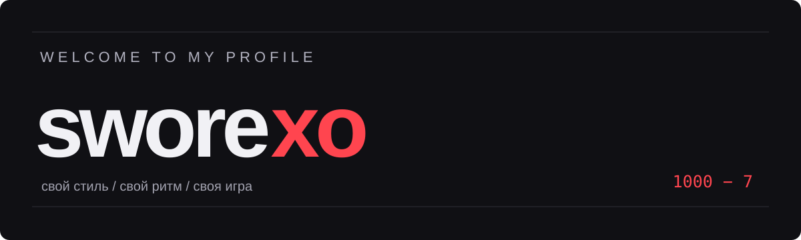
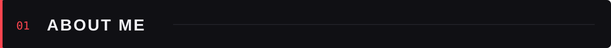
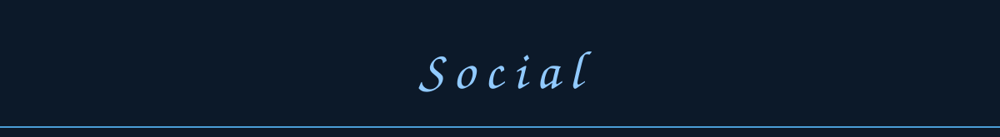

- В интернете я — **sworexo**, на GitHub — **liillmses-maker**. Здесь собираю свои проекты, эксперименты и идеи.

- Мой вайб — **гуль zxc настроящий кайф**. Свой стиль, свой ритм и своя игра.

- Эта страница — место для моего кода и всего, что появится дальше. Репозитории можно посмотреть ниже.

- *never gonna give u up never gonna let u down.*

 

---

- **Python** — код в моём репозитории [Zcchja](https://github.com/liillmses-maker/Zcchja).

- **HTML & CSS** — моя [страница-визитка](https://liillmses-maker.github.io/gul-zxc/) и её [исходный код](https://github.com/liillmses-maker/gul-zxc).

- **GitHub Pages** — публикация личного сайта.

- **[zxc](https://github.com/liillmses-maker/zxc)** — ещё один проект в моей коллекции.

 

---

- **[Мой сайт](https://liillmses-maker.github.io/gul-zxc/)** — гуль zxc настроящий кайф.

- **[GitHub](https://github.com/liillmses-maker)** — @liillmses-maker.

- **[Репозитории](https://github.com/liillmses-maker?tab=repositories)** — мои проекты и эксперименты.

 

1000 − 7 · sworexo

Layout inspiration & city banner: <a href="https://github.com/5dwn">5dwn</a>

