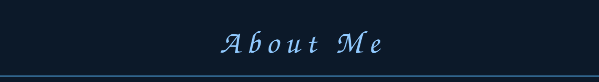
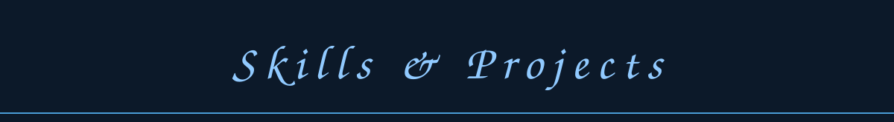

 
I'm sworexo. I work on my own projects, write code, and try out new ideas. I enjoy figuring out how things work and building things I'd want to use myself.

I work with Lua and C++. I'm interested in interfaces and automation. I usually start with a small idea and gradually turn it into something that works.

Besides coding, I enjoy design. I like projects that have their own personality and look clean. Sometimes I spend a lot of time on small details because they matter to me too.

I try to keep my code readable and organized. Things don't always work on the first try, but I want to improve with every project.

I'm always open to conversations, sharing ideas, and working together. If you want to talk, feel free to get straight to what's on your mind.
 

---

**Lua** is what I use for scripts and personal experiments. I like being able to test ideas quickly and see where they lead.

**C++** interests me because it helps me understand how programs work and get closer to the system.

**Python** is also part of my projects. You can find some of my code in [Zcchja](https://github.com/liillmses-maker/Zcchja).

**HTML and CSS** power my [personal website](https://liillmses-maker.github.io/gul-zxc/). Its [source code](https://github.com/liillmses-maker/gul-zxc) is available here on GitHub.

 

---

You can get to know me a little on [my website](https://liillmses-maker.github.io/gul-zxc/). My other projects and experiments are collected in my [repositories](https://github.com/liillmses-maker?tab=repositories).

Online I go by sworexo, and here I'm [liillmses-maker](https://github.com/liillmses-maker). I'm always happy to meet new people and hear interesting ideas.

 

1000 − 7 · sworexo

Layout inspiration & city banner: <a href="https://github.com/5dwn">5dwn</a>

